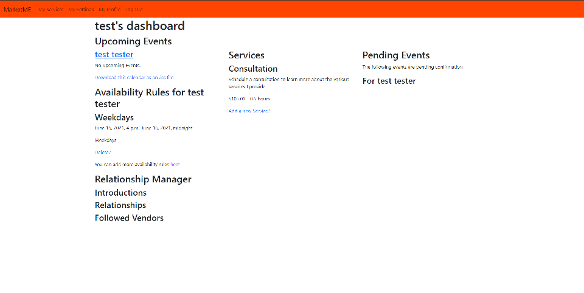

# 'MarketMe' Post Mortem

MarketMe was an attempt at building an integrated calendar and social media manager for freelancers.  Built using Django, I worked on this project for around 3 months, but my enthusiasm waned as errors in my original conception became glaringly obvious.  I'll use this readme to cast a critical eye at the successes and failures of this project.



## Outline
#### What was planned?
 MarketMe was a mockup of a calendar and social media integration service, which would allow freelancers to offer services, check their calendar and preview their social media without the distraction of their social media.  Their calendar would be open to other users, which could claim blocks of time based on services provided and time slots available.


#### What was accomplished?
Using Django, I was able to build a database model to cover our user's needs, with a calendar based off of the 'iCalendar' spec (RFC 5545), storage for future social media campaigns and a relationship model to allow conditional access to potential clients.  Django's HTML template engine and Beautiful Soup, a Python HTML parser, were used to build a collection of static html pages to serve as the front end, with some small adjustments using CSS and Javascript.  

#### What went wrong?
While I think the idea was strong (and indeed, there are several products that offer such an integration layer for small businesses), my lack experience led to some design decisions that ultimately undermined the project.  The scope and structure of the project was very ambitious, but unfortunately the added complexity was counter productive in creating a service that would live up to the design.  With that said, I feel MarketMe was a successful learning experience.

## Calendar


#### Overview
Basing the calendar on the 'iCalendar' spec, I had hoped to provide the user with an easily sharable calendar that could also handle importing calendars from other sources.  To build my comfort with the standard, I built an 'iCalendar' parser, that would allow MarketMe to place all defined fields as an object and provide a relatively simple way to take any .ics file and import it into our database.  

#### Challenges
While the database design was built based on the 'iCalendar' spec, it was difficult to find an intuitive way to allow users to define certain time based rules on their calendar, such as available hours, recurring events and timezones.  There were also lessons learned about standards, like 'iCalendar', and the difficulties encountered when trying to use our calendars on proprietary calendar programs like those offered by Microsoft and Google.

## Post Mortem - Lessons Learned
* Narrow scope
>Focus on a specific domain and master it before integrating additional domains.
* Manage complexity 
>Parcel up tasks into completable steps.
* Don't mess with time
>Did you know it's been more than 1,643,689,341 seconds since New Years Day in 1970?

## Technical Directory
The structure of Market Me should be familiar to anyone experienced in Django, but for the uninitiated,  we have the main project folder MarketMe where most of the Django specific settings are set.  There are also three apps, MMcalendar, MMsocial and MMUX which control the user experience.
* MMux/

```Views.py controls both user authentication and our dashboard, which is conditionally rendered in templates/MMUX/index.html depending on whether the user is registered or not.  Models.py controls our database's user representation as well as the relationship model.```

* MMcalendar/

```Views.py controls our serverside calendar operations, while models.py controls the calendar's representation as well as the individual events and services.  templates/MMcalendar contains our html templates for our calendar views, while the MMiCal directory holds my attempt at building the iCalendar parser.```

* MMSocial/

```Only file of note is models.py, where the database model for our social media manager is roughly sketched.```